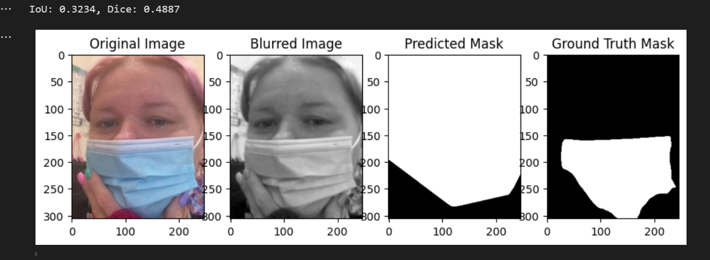

# Face Mask Detection, Classification, and Segmentation

# Visual Recognition Project

<h3 align = "center">
Varsha Yamsani(IMT2022506): Yamsani.Varsha@iiitb.ac.in<br> 
R Harshavardhan(IMT2022515): R.Harshavardhan@iiitb.ac.in<br>
Keshav Goyal(IMT2022560) Keshav.Goyal560@iiitb.ac.in</h3>

# Introduction

Develop a computer vision solution to classify and segment face masks in images. The
project involves using handcrafted features with machine learning classifiers and deep
learning techniques to perform classification and segmentation.

# Dataset and Libraries used

A labeled dataset containing images of people with and without face masks and a Masked
Face Segmentation dataset with ground truth face masks was given.

- For the dataset corresponding to the binary classification task, we have a total of
    4,095 images, with 2,165 images labeled as with_maskand 1,930 images labeled
    as without_mask, indicating that the dataset is well-balanced.<br>
    Dataset: https://github.com/chandrikadeb7/Face-Mask-Detection/tree/master/dataset
- For the dataset corresponding to the binary segmentation task, we have a total of
    9,382 images in the face_crop directory, along with 9,382 corresponding labels
    (segmented output masks). Each input image is an RGB image of size (128, 128,
    3), while the segmented binary mask output is a grayscale image of size (128, 128,
    1).<br>
    Dataset: https://github.com/sadjadrz/MFSD

The libraries used in the project are as follows:

- **TensorFlow & Keras**: Deep learning model building and training.
- **OpenCV & scikit-image**: Image processing and feature extraction.
- **matplotlib**: For data visualization.
- **scikit-learn**: For machine learning model implementation and evaluation.
- **NumPy**: Numerical computations.


#Binary Classification(Task A and B)

# Task A: Using Handcrafted Features and ML Classifiers

- **Methodology**: Feature extraction was performed using three techniques to capture important image characteristics:<br>
    - **Histogram of Oriented Gradients (HOG)**: Extracted shape and texture
        information by computing gradients in localized regions of the image.<br>
    - **Sobel Edge Detection**: Detected edges in both x and y directions and
        computed the gradient magnitude.<br>
    - **Canny Edge Detection**: Applied a multi-stage edge detection algorithm
        to highlight significant image contours.<br>
    - The extracted features were combined into a single feature vector for each
        image<br>
- **Model Training**: Two models were trained for classification:
    - **Support Vector Machine(SVM)**: A linear kernel SVM was trained on the
       extracted features to separate classes effectively.
    - **Multi-Layer Perceptron(MLP)**: A neural network with two hidden layers
       (64 and 32 neurons) was trained using 300 iterations to learn complex
       patterns.
- **Results**:
    - The results obtained show how MLP works better than SVM in classification problem.
    <div align="center">

    <table>
    <tr>
        <th>Model</th>
        <th>Test Accuracy</th>
    </tr>
    <tr>
        <td> SVM</td>
        <td>Neural Network(MLP)  </td>
    </tr>
    <tr>
        <td>88.4%</td>
        <td>91.94%</td>
    </tr>
    </table>

    <p><i><b>Table 1:ML Classifiers Model Performance Comparison</b></i></p>

    </div>
    

- **Observation and analysis**:
    - **Figure 1**
    - **Classification Report**<br>  
   <p align="center">
  <a href="image1_url"></a>
    </p>

    - MLP achieved 92% accuracy, outperforming SVM’s 88%, with higher precision and recall, especially for class 1 (mask detected). SVM struggled
        with complex feature extraction, leading to slightly lower performance.
    - MLP’s deep learning capabilities enabled better generalization, though at
        the cost of increased computational complexity.
    - A key challenge was that increasing layers in MLP didn’t improve performance, likely due to overfitting or vanishing gradients.

# Task B: Using CNN
## Methodolgy:
- The CNN model was built to classify images into "with mask" and "with-
out mask" categories. The dataset was split into training and testing sets
(80%-20%).
- A sequential CNN architecture was implemented with three convolutional
layers, max-pooling layers, dropout for regularization, and a dense output
layer with either a sigmoid or tanh activation function.
- The model was trained with Adam and SGD optimizers, different dropout
values (0.3, 0.5), and learning rates (0.001, 0.0001). Early stopping and
learning rate reduction were used to optimize training.
- The models were saved and evaluated to compare performance
## Hyperparameters and Experiments:
- The model was trained for 20 epochs with validation loss monitoring.
- Multiple experiments were conducted by varying hyperparameters such as
    optimiser type(Adam/SGD), dropout rate and learning rate.
- Two versions of the CNN were tested- one using sigmod activation in the
    output layer and another using tanh layers.
- Adding another Conv2D(256) layer didn’t improve accuracy significantly
    because the previous layers (32, 64, 128) likely already extracted sufficient
    features, making additional filters redundant. (96.83% to 96.91%)
## Results:
<div align="center">

<p>
<a href="image1_url">
    
</a>
&nbsp;&nbsp;&nbsp;&nbsp;
<a href="image2_url">
    
</a>
</p>

<p>
<b>Testing accuracy with sigmoid function in output layer</b>
&nbsp;&nbsp;&nbsp;&nbsp;
<b>Testing accuracy with tanh function in output layer</b>
</p>

<p><i>Figure 2: CNN Results.</i></p>

</div>


- This shows how for same optimizer, dropout and learning rate, we get different accuracy for different activation function, showing how the choice matters for the same.
<div align="center">

<table>
<tr>
    <th>Model</th>
    <th>Test Accuracy</th>
</tr>
<tr>
    <td> SVM</td>
    <td>88.4% </td>
</tr>
<tr>
    <td>Neural Network(MLP)</td>
    <td>91.94%</td>
</tr>
<tr>
    <td> CNN</td>
    <td> 96.83% </td>
</table>

<p><i><b>Table 2: ML Classifiers and CNN Model Performance Comparison</b></i></p>

</div>


- The above shown table shows how our best CNN model performs better
    than traditional ML Based approach for Binary Classification of Images.
## Observation and Analysis:
- One challenge was that increasing the number of layers did not always
improve performance, likely due to overfitting.
- The choice of optimizer and dropout significantly influenced results.Adam
generally outperformed SGD, and moderate dropout (0.3) helped in better
generalization.
- The choice of activation function in the last layer affected the output accu-
racy.
- The training time was usually around 6-7 minutes, which is more than the time taken for MLP and SVM based approach(Usually 1-1.5 minutes).


# Task C
## Methodology: 
- The segmentation process involved traditional image processing techniques. The key steps were:  

    - **Preprocessing**:
        - Convert the input image to grayscale.  
        - Apply Gaussian Blur to reduce noise.  

    - **Segmentation**:  
        - Use Otsu’s thresholding for binarization.  
        - Apply morphological closing (dilation followed by erosion) to refine the mask.  
        - Extract the largest contour and use a convex hull to define object boundaries.  

    - **Evaluation**:  
        - The generated mask is compared with the ground truth using **IoU (Intersection over Union)** and **Dice Score**.  
        - Masks are normalized to binary (0 and 1) for fair evaluation.  

## Results : 
- The segmentation approach was evaluated using **IoU** and **Dice Score**.  
- **Average Scores**:  
    - **IoU**: `0.3291` 
    - **Dice Score**: `0.4676`
- Example output is shown for two of the cases:   
<div align="center">

<p>
<a href="image1_url">
    
</a>
<p>
<b>The results show IOU: 0.3234 and Dice Score: 0.4987</b>
</p>

<p><i>Figure 3: Output for one of the example case.</i></p>
</div>
    <div align="center">

<p>
<a href="image1_url">
    
</a>
<p>
<b>The results show IOU: 0.9325 and Dice Score: 0.9651</b>
</p>

<p><i>Figure 4: Output for second example case.</i></p>
</div>

## Observations and Analysis  
- Thresholding-based segmentation worked well for simple masks, as  showin in second figure,  but lacked adaptability to complex variations.  
## Challenges Faced:
- Thresholding alone struggled with shadows and varying lighting conditions.  
- Convex Hull improved boundary accuracy but failed in occluded or complex cases. 


# Task D
## Methodology

### Data Preprocessing
   - Images and masks were resized to **128x128** pixels.
   - Images were normalized to **[0,1]** by dividing pixel values by 255.
   - The dataset was split into training and testing sets (80-20 split).
   - TensorFlow tensors were used to maintain compatibility with the models.
   - Masks were binarized using a threshold of **0.5**, converting pixel values to either 0 or 1.
   
---

### CNN Model Training

- A convolutional neural network (CNN) was implemented for classification. The model architecture includes:
    - **Conv2D layers** with increasing filters (32, 64, 128) to extract features.
    - **MaxPooling layers** to downsample feature maps.
    - **Fully connected layers** with dropout to prevent overfitting.
    - **Sigmoid activation** in the output layer for binary classification.

- Hyperparameter Variations
    - **Optimizers**: Adam, SGD
    - **Dropout rates**: 0.3, 0.5
    - **Learning rates**: 1e-3, 1e-4
    - **Epochs**: 20
    - **Early Stopping & ReduceLROnPlateau**: Used to prevent overfitting and dynamically adjust the learning rate.

Each model was trained with different combinations of these hyperparameters, and performance was evaluated based on accuracy.

---

### U-Net Model for Segmentation

A **U-Net** model was implemented for segmentation with the following architecture:
- **Encoder**: Repeated **Conv2D** layers with ReLU activation followed by **MaxPooling** layers to extract features.
- **Bottleneck**: A deeper convolutional layer with **1024 filters**.
- **Decoder**: **Conv2DTranspose** layers with concatenation to restore spatial information and upsample.
- **Final Layer**: A **1x1 convolution** with sigmoid activation for binary mask prediction.

## Hyperparameter Variations
Three different configurations were tested:
1. **Model 1**: Learning rate **1e-4**, batch size **16**, 5 epochs
2. **Model 2**: Learning rate **1e-3**, batch size **32**, 5 epochs
3. **Model 3**: Learning rate **1e-3**, batch size **16**, 5 epochs

---
## Results

<div align="center">

<p>
<a href="image1_url">
    
</a>

<p><i>Figure 5: Training and validation loss for the three models.</i></p>
</div>

<div align="center">

<p>
<a href="image1_url">
    
</a>

<p><i>Figure 6: Training and validation IOU metric for the three models.</i></p>
</div>

<div align="center">

<table>
<tr>
    <th>Model</th>
    <th>Learning Rate</th>
    <th>Batch Size</th>
    <th>Test IOU Score</th>
</tr>
<tr>
    <td> Model 1</td>
    <td> 1e-4 </td>
    <td> 16</td>
    <td>0.9090</td>
</tr>
<tr>
    <td>Model 2</td>
    <td>1e-3</td>
    <td>32</td>
    <td>0.9122</td>
</tr>
<tr>
    <td>Model 3</td>
    <td>1e-3</td>
    <td>16</td>
    <td>0.9115</td>
</table>

<p><i><b>Table 3: IOU Score comparision for three models</b></i></p>

</div>
<div align="center">

<p>
<a href="image1_url">
    
</a>

<p><i>Figure 7: Example output for best model 2.</i></p>
</div>

<div align="center">

<p>
<a href="image1_url">
    
</a>

<p><i>Figure 8: Example output for best model 2.</i></p>
</div>

## Observations and Analysis

### Insights Gained from the Results
- The U-Net model effectively performed binary segmentation, demonstrating its capability to distinguish foreground (face regions) from the background.  
- The choice of hyperparameters significantly impacted model performance:  
  - **Lower learning rate (1e-4)** led to more stable convergence.  
  - **Higher batch size (32)** improved generalization but required more computational resources.  
- The **evaluation metrics** (IoU, Dice Score, Precision, Recall, and Accuracy) provided a comprehensive understanding of model performance.  
- **Fine-tuning hyperparameters** improved segmentation accuracy, with **batch size and learning rate being key factors.**  

### Challenges Faced and Solutions  
#### **Computational Constraints**  
- Larger batch sizes (e.g., 32) demanded higher memory. Training was mainly done on CPU which required a lot of time to train  
- **Solution:** Adjusted batch sizes dynamically based on available hardware.   

#### **Mask Binarization Issues**  
- Some masks had grayscale variations instead of clear binary segmentation.  
- **Solution:** Applied **thresholding (y > 0.5 → 1, else 0)** before training.  

# Dependencies and Running Instructions

## Dependencies

If you are using a virtual environment, activate it before running the scripts. Install jupyter notebook if you haven't already. The command for the same is: 
```
pip install jupyter notebook
````
To run the
Python scripts, ensure you have the following libraries installed. You can install them
using:
```
pip install numpy tensorflow matplotlib scikit-image scikit-learn opencv-python jupyter

```
## Running the Code

Follow these steps to run the code in your terminal:

- Navigate to the directory containing the Python files:
  ```
  cd /VR_Project1_Varsha_Keshav_Harshavardhan_IMT2022506_560_515
  ```
- Start jupyter notebook:
  ```
  jupyter notebook
  ```
- To run the Mask Classification script:
  ```
  Run binaryClassification.ipynb
  ```
- To run the Mask Segmentation script:
   ```
  Run binarySegmentation.ipynb
    ```
## Important Links and Documents

- Dataset Source: https://github.com/chandrikadeb7/Face-Mask-Detection/tree/master/dataset<br>https://github.com/sadjadrz/MFSD
- Project Code Repository: https://github.com/keshavv79/VR_Project1_Varsha_Keshav_Harshavardhan_IMT2022506_560_515


